Group EDA
================
Jamie Walters
11/11/2021

### Are there any problems with the data?

``` r
summary(train)
```

    ##  dateCrawled            name              seller           offerType        
    ##  Length:151479      Length:151479      Length:151479      Length:151479     
    ##  Class :character   Class :character   Class :character   Class :character  
    ##  Mode  :character   Mode  :character   Mode  :character   Mode  :character  
    ##                                                                             
    ##                                                                             
    ##                                                                             
    ##      price             abtest          vehicleType        yearOfRegistration
    ##  Min.   :       0   Length:151479      Length:151479      Min.   :1000      
    ##  1st Qu.:    1150   Class :character   Class :character   1st Qu.:1999      
    ##  Median :    2950   Mode  :character   Mode  :character   Median :2003      
    ##  Mean   :   11296                                         Mean   :2005      
    ##  3rd Qu.:    7200                                         3rd Qu.:2008      
    ##  Max.   :99999999                                         Max.   :9999      
    ##    gearbox             powerPS           model             kilometer     
    ##  Length:151479      Min.   :    0.0   Length:151479      Min.   :  5000  
    ##  Class :character   1st Qu.:   70.0   Class :character   1st Qu.:125000  
    ##  Mode  :character   Median :  105.0   Mode  :character   Median :150000  
    ##                     Mean   :  114.9                      Mean   :125680  
    ##                     3rd Qu.:  150.0                      3rd Qu.:150000  
    ##                     Max.   :17019.0                      Max.   :150000  
    ##  monthOfRegistration   fuelType            brand           notRepairedDamage 
    ##  Min.   : 0.000      Length:151479      Length:151479      Length:151479     
    ##  1st Qu.: 3.000      Class :character   Class :character   Class :character  
    ##  Median : 6.000      Mode  :character   Mode  :character   Mode  :character  
    ##  Mean   : 5.742                                                              
    ##  3rd Qu.: 9.000                                                              
    ##  Max.   :12.000                                                              
    ##  dateCreated         nrOfPictures   postalCode      lastSeen        
    ##  Length:151479      Min.   :0     Min.   : 1067   Length:151479     
    ##  Class :character   1st Qu.:0     1st Qu.:30519   Class :character  
    ##  Mode  :character   Median :0     Median :49661   Mode  :character  
    ##                     Mean   :0     Mean   :50888                     
    ##                     3rd Qu.:0     3rd Qu.:71636                     
    ##                     Max.   :0     Max.   :99998

``` r
## Remove nrOfPictures, all 0
train = train[,-18]
test = test[,-18]
```

``` r
## Convert to factor variables

## seller
train$seller = as.factor(train$seller)
test$seller = as.factor(test$seller)

## offerType
train$offerType = as.factor(train$offerType)
test$offerType = as.factor(test$offerType)

## abtest
train$abtest = as.factor(train$abtest)
test$abtest = as.factor(test$abtest)

## vehicleType
train$vehicleType = as.factor(train$vehicleType)
test$vehicleType = as.factor(test$vehicleType)

## gearbox
train$gearbox = as.factor(train$gearbox)
test$gearbox = as.factor(test$gearbox)

## model
train$model = as.factor(train$model)
test$model = as.factor(test$model)

## fuelType
train$fuelType = as.factor(train$fuelType)
test$fuelType = as.factor(test$fuelType)

## brand
train$brand = as.factor(train$brand)
test$brand = as.factor(test$brand)

## notRepairedDamage
train$notRepairedDamage = as.factor(train$notRepairedDamage)
test$notRepairedDamage = as.factor(test$notRepairedDamage)

## monthOfRegistration
train$monthOfRegistration = as.factor(train$monthOfRegistration)
test$monthOfRegistration = as.factor(test$monthOfRegistration)
```

``` r
## Filter yearOfRegistration to be from 1900 to 2022
train = train[train$yearOfRegistration >= 1900 & train$yearOfRegistration <= 2022, ]
range(train$yearOfRegistration)
```

    ## [1] 1910 2019

``` r
test = test[test$yearOfRegistration >= 1900 & test$yearOfRegistration <= 2022, ]
range(test$yearOfRegistration)
```

    ## [1] 1910 2019

``` r
## Filter powerPS to be less than 1000
train = train[train$powerPS < 1000, ]
range(train$powerPS)
```

    ## [1]   0 999

``` r
test = test[test$powerPS < 1000, ]
range(train$powerPS)
```

    ## [1]   0 999

``` r
## Filter price 
hist(train$price)
```

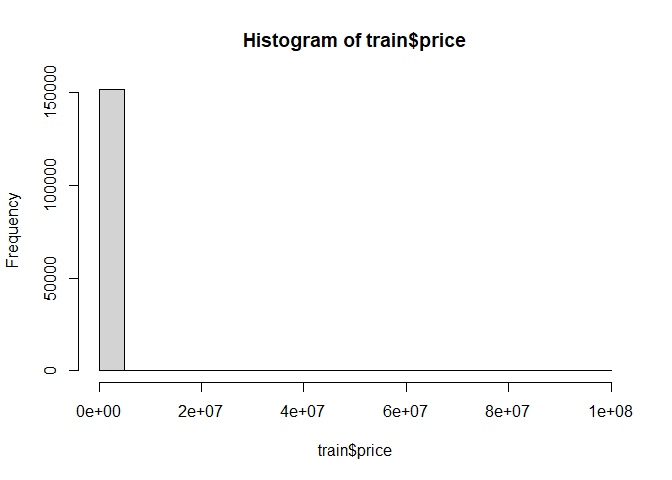<!-- -->

``` r
train = train[train$price > 0 & train$price <= 500000, ]
test = test[test$price > 0 & test$price <= 500000, ]
```

There were quite a few errors in the data that needed cleaned up. First,
we got rid of nrOfPictures, because all of the values were 0 and the
description said it was an error. Next we converted the character
columns to factor variables. Next, we filtered the yearOfRegistration to
be between 1900 to 2022. The minimum was 1000 and the maximum was 9999,
which seem to be placeholders. We also filtered powerPS to be less than
1000 because everything after 1000 seems to be fake listings because the
prices were so low. Price also had placeholders like 99999999, 12345678,
and 0. We filtered price to be greater than 0 and less than or equal to
500000.

``` r
## Create a column for the number of days the listing was online (lastSeen - dateCreated)

train$dateCreated = as.Date(train$dateCreated)
train$lastSeen = as.Date(train$lastSeen)
train$date_diff = train$lastSeen - train$dateCreated
train$date_diff = as.numeric(train$date_diff)

test$dateCreated = as.Date(test$dateCreated)
test$lastSeen = as.Date(test$lastSeen)
test$date_diff = test$lastSeen - test$dateCreated
test$date_diff = as.numeric(test$date_diff)
```

### Is there any missing data?

``` r
## Any missing data?
for(i in 1:ncol(train)){
    cat(any(is.na(train[,i])),"\n")
}
```

    ## FALSE 
    ## FALSE 
    ## FALSE 
    ## FALSE 
    ## FALSE 
    ## FALSE 
    ## FALSE 
    ## FALSE 
    ## FALSE 
    ## FALSE 
    ## FALSE 
    ## FALSE 
    ## FALSE 
    ## FALSE 
    ## FALSE 
    ## FALSE 
    ## FALSE 
    ## FALSE 
    ## FALSE 
    ## FALSE

``` r
for(i in 1:ncol(test)){
    cat(any(is.na(test[,i])),"\n")
}
```

    ## FALSE 
    ## FALSE 
    ## FALSE 
    ## FALSE 
    ## FALSE 
    ## FALSE 
    ## FALSE 
    ## FALSE 
    ## FALSE 
    ## FALSE 
    ## FALSE 
    ## FALSE 
    ## FALSE 
    ## FALSE 
    ## FALSE 
    ## FALSE 
    ## FALSE 
    ## FALSE 
    ## FALSE 
    ## FALSE

``` r
for(i in 1:ncol(train)){
    cat(any(is.nan(train[,i])),"\n")
}
```

    ## FALSE 
    ## FALSE 
    ## FALSE 
    ## FALSE 
    ## FALSE 
    ## FALSE 
    ## FALSE 
    ## FALSE 
    ## FALSE 
    ## FALSE 
    ## FALSE 
    ## FALSE 
    ## FALSE 
    ## FALSE 
    ## FALSE 
    ## FALSE 
    ## FALSE 
    ## FALSE 
    ## FALSE 
    ## FALSE

``` r
for(i in 1:ncol(test)){
    cat(any(is.nan(test[,i])),"\n")
}
```

    ## FALSE 
    ## FALSE 
    ## FALSE 
    ## FALSE 
    ## FALSE 
    ## FALSE 
    ## FALSE 
    ## FALSE 
    ## FALSE 
    ## FALSE 
    ## FALSE 
    ## FALSE 
    ## FALSE 
    ## FALSE 
    ## FALSE 
    ## FALSE 
    ## FALSE 
    ## FALSE 
    ## FALSE 
    ## FALSE

``` r
## Checking empty for train
count(train %>% filter(vehicleType == ""))
```

    ##       n
    ## 1 13851

``` r
count(train %>% filter(gearbox == ""))
```

    ##      n
    ## 1 7167

``` r
count(train %>% filter(model == ""))
```

    ##      n
    ## 1 7295

``` r
count(train %>% filter(fuelType == ""))
```

    ##       n
    ## 1 11987

``` r
count(train %>% filter(notRepairedDamage == ""))
```

    ##       n
    ## 1 26910

``` r
## Checking empty for test
count(test %>% filter(vehicleType == ""))
```

    ##      n
    ## 1 3538

``` r
count(test %>% filter(gearbox == ""))
```

    ##      n
    ## 1 1882

``` r
count(test %>% filter(model == ""))
```

    ##      n
    ## 1 1919

``` r
count(test %>% filter(fuelType == ""))
```

    ##      n
    ## 1 3095

``` r
count(test %>% filter(notRepairedDamage == ""))
```

    ##      n
    ## 1 6791

There are no na’s or nan’s, but five columns have empty values.

### Does there appear to be potentially problematic collinearity amongst the predictor variables?

``` r
## Pairs plot of continuous variables
range(train$price)
```

    ## [1]      1 445000

``` r
boxplot(train$price, ylim = c(0,20000), main = 'price')
```

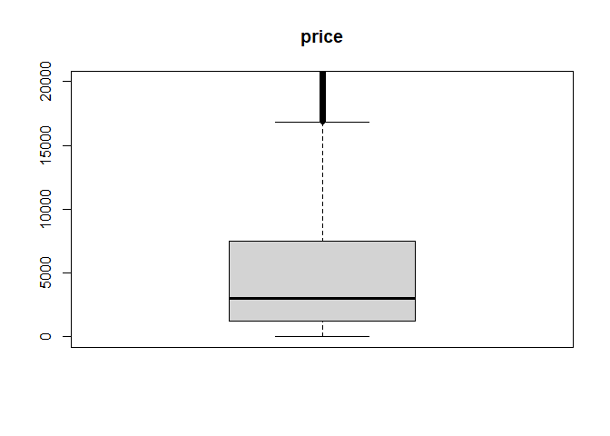<!-- -->

``` r
hist(train$price[train$price < 25000])
```

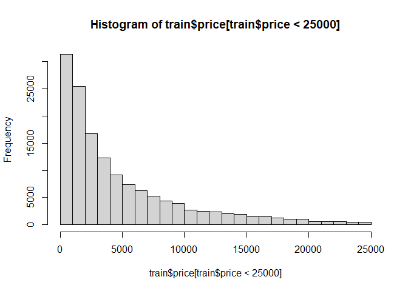<!-- -->

``` r
hist(log(train$price))
```

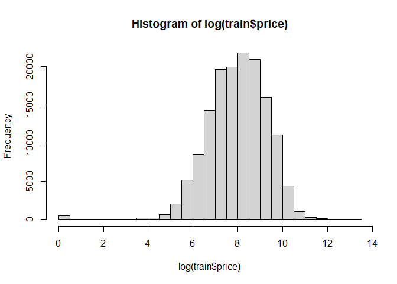<!-- -->

``` r
range(train$powerPS)
```

    ## [1]   0 999

``` r
boxplot(train$powerPS, ylim = c(0, 300), main = 'powerPS')
```

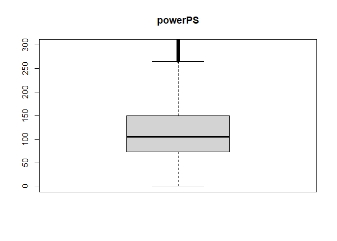<!-- -->

``` r
hist(train$powerPS)
```

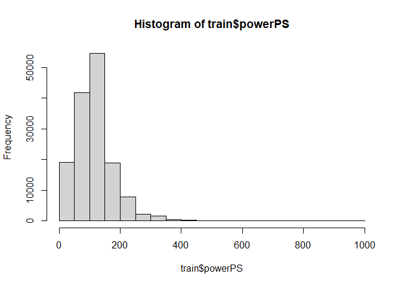<!-- -->

``` r
range(train$kilometer)
```

    ## [1]   5000 150000

``` r
boxplot(train$kilometer, ylim = c(85000, 200000), main = 'kilometer')
```

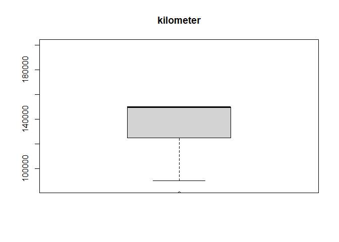<!-- -->

``` r
hist(train$kilometer)
```

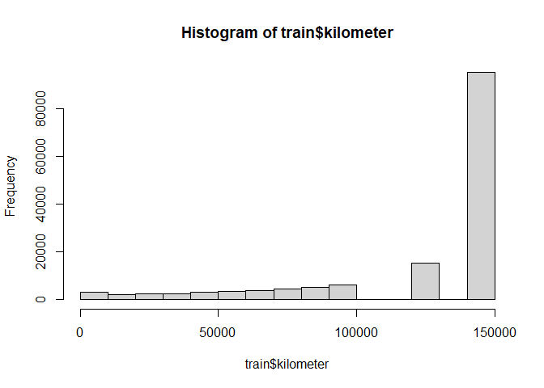<!-- -->

``` r
range(train$date_diff)
```

    ## [1]   0 759

``` r
boxplot(train$date_diff, ylim = c(0, 35), main = 'date_diff')
```

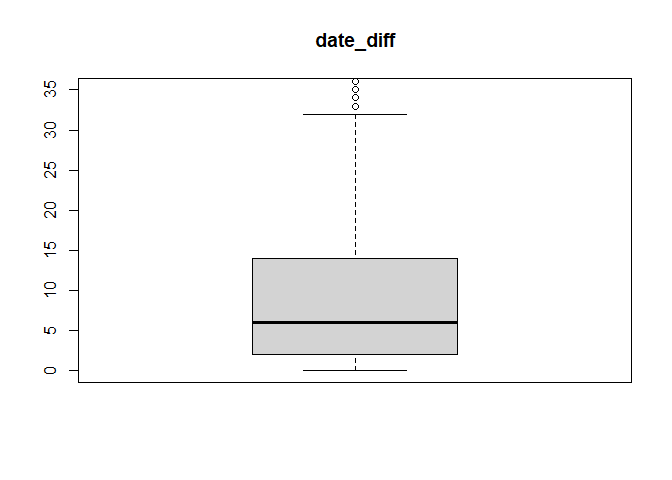<!-- -->

``` r
hist(train$date_diff[train$date_diff < 40])
```

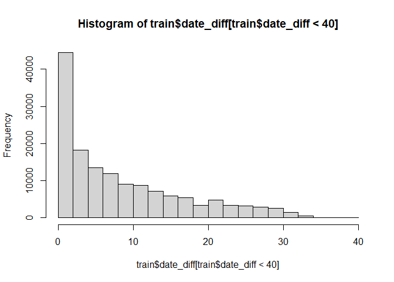<!-- -->

``` r
plot(train[,c(5, 8, 10, 12, 20)])
```

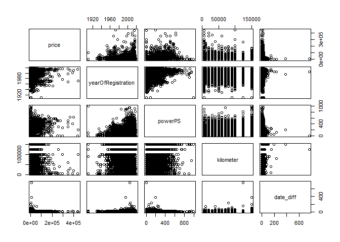<!-- -->

Price, powerPS, and date_diff have mostly small values with some high
outliers.

Kilometer is interesting. The max value of 150000 is also the median.
There are also gaps in the histogram. The number of vehicles in each bin
is relatively even, maybe slightly increaseing, from 0-100000. Then
there’s a gap until about 125000, and again between 125000 and 150000.
The bin for 150000 is huge, most of the data falls here.

The histograms for price, powerPS, and date_diff all appear to be right
skewed.

From the pairs plot, it doesn’t seem like there’s much collinearity.

``` r
cor(select_if(train, is.numeric), use = "complete.obs")
```

    ##                          price yearOfRegistration     powerPS   kilometer
    ## price               1.00000000         0.24864707  0.49398990 -0.37320294
    ## yearOfRegistration  0.24864707         1.00000000  0.15197560 -0.23276110
    ## powerPS             0.49398990         0.15197560  1.00000000 -0.02901261
    ## kilometer          -0.37320294        -0.23276110 -0.02901261  1.00000000
    ## postalCode          0.07324649         0.03220954  0.08363474 -0.02936785
    ## date_diff           0.10967453         0.01968106  0.08125256 -0.08426851
    ##                     postalCode   date_diff
    ## price               0.07324649  0.10967453
    ## yearOfRegistration  0.03220954  0.01968106
    ## powerPS             0.08363474  0.08125256
    ## kilometer          -0.02936785 -0.08426851
    ## postalCode          1.00000000  0.03369409
    ## date_diff           0.03369409  1.00000000

From the correlation matrix, it also doesn’t look like there’s any
collinearity to worry about.

### What are they key figures or numerical summaries that describe the most aspects of the data?

``` r
## Boxplots for factor vars
with(train,{
  plot(price~seller, ylim = c(0, 25000))
  plot(price~offerType, ylim = c(0, 25000))
  plot(price~vehicleType, ylim = c(0, 25000))
  plot(price~gearbox, ylim = c(0, 25000))
  plot(price~fuelType, ylim = c(0, 25000))
  plot(price~brand, ylim = c(0, 25000))
  plot(price~notRepairedDamage, ylim = c(0, 25000))
  plot(price~monthOfRegistration, ylim = c(0, 25000))
})
```

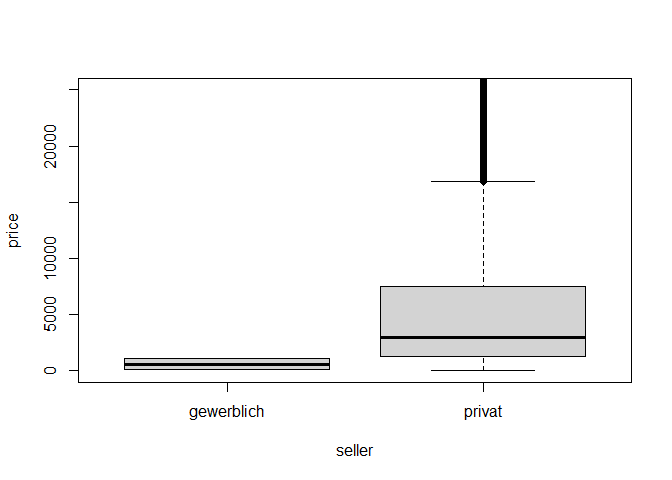<!-- -->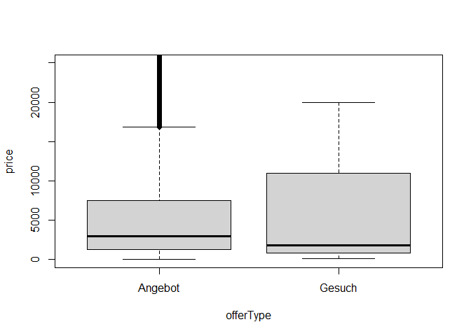<!-- -->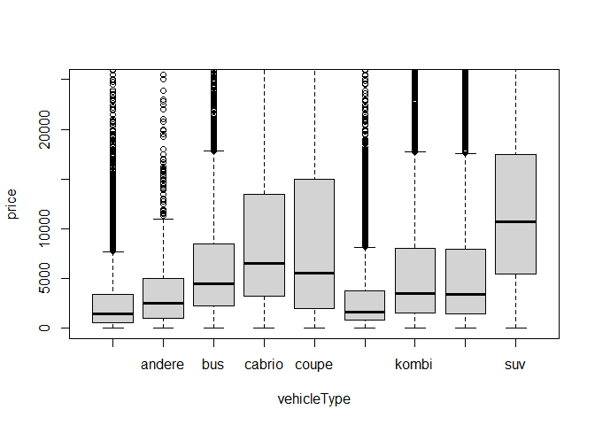<!-- -->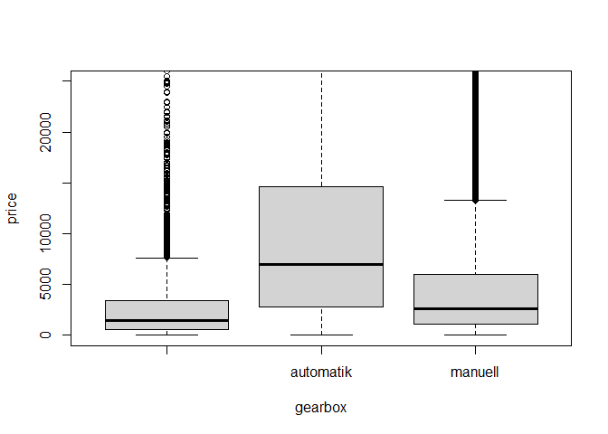<!-- -->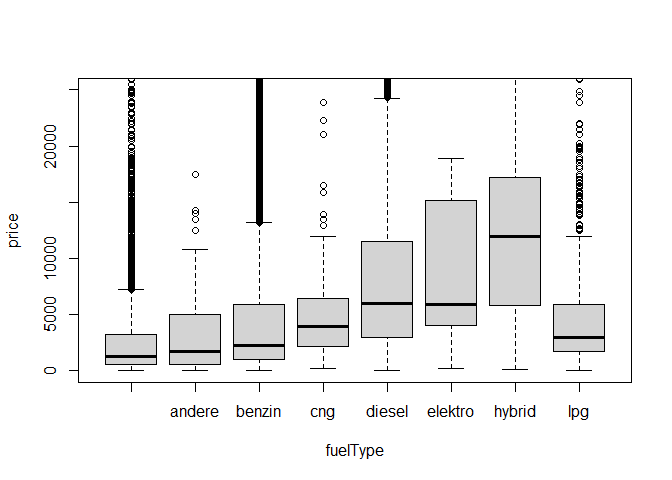<!-- -->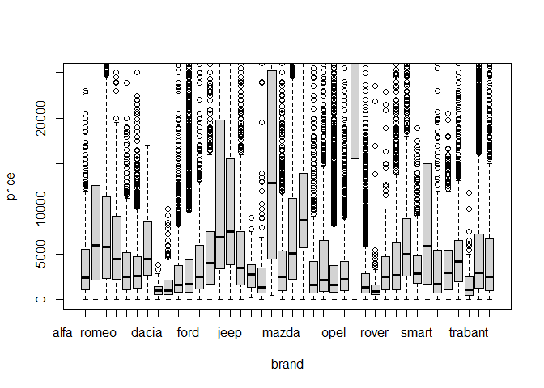<!-- -->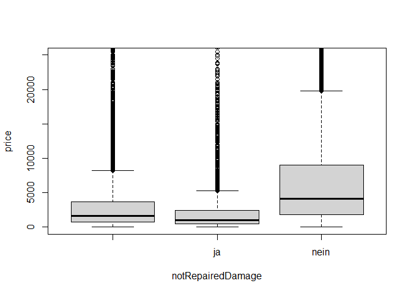<!-- -->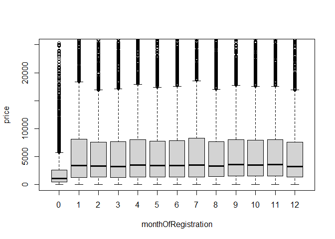<!-- -->

``` r
## Drop abtest, they look like the same thing, something related to the data scraping? 
train = train[, -6]
train[train$seller=='gewerblich',]
```

    ##               dateCrawled                                        name
    ## 30293 2016-03-15 18:06:22 Verkaufe_mehrere_Fahrzeuge_zum_Verschrotten
    ## 77709 2016-03-22 09:54:43             Chevrolet_Matiz_1.Hd_TÜV11/2017
    ##           seller offerType price vehicleType yearOfRegistration gearbox powerPS
    ## 30293 gewerblich   Angebot   100       kombi               2000 manuell       0
    ## 77709 gewerblich   Angebot  1100  kleinwagen               2006 manuell      38
    ##        model kilometer monthOfRegistration fuelType     brand notRepairedDamage
    ## 30293 megane    150000                   8   benzin   renault                  
    ## 77709  matiz    150000                  10   benzin chevrolet              nein
    ##       dateCreated postalCode   lastSeen date_diff
    ## 30293  2016-03-15      65232 2016-04-06        22
    ## 77709  2016-03-22       7973 2016-04-05        14

``` r
plot(train$powerPS, train$price)
```

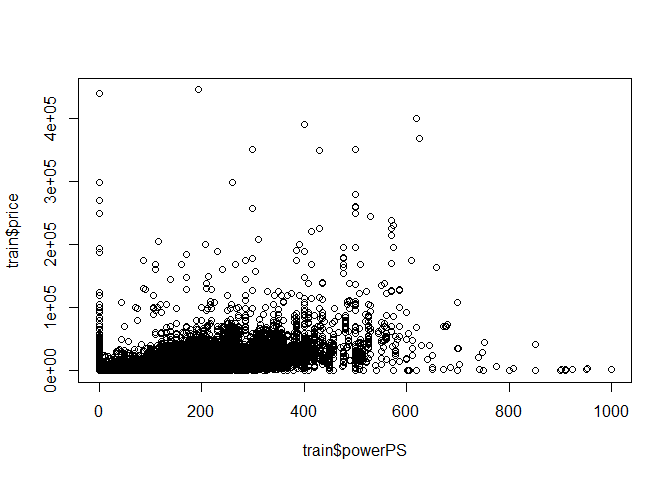<!-- -->

``` r
plot(train$kilometer, train$price)
```

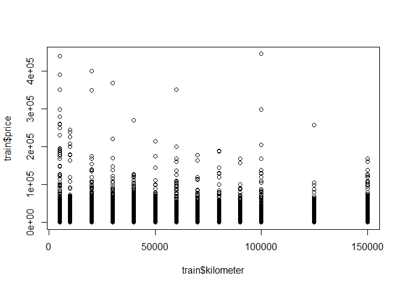<!-- -->

Boxplot for seller looks odd for ‘gewerblich’, which means a commercial
seller. It turns out there’s only 2 vehicles sold through a commercial
seller.

Most of the boxplots have a lot of outliers on the high price end. Most
of the boxplots look to be right skewed.

The plot of price vs power looks like there’s a clump in the lower left
hand corner of the plot. This may indicate some sort of relationship

The plot of price vs kilometer is less clear, there may be some sort of
polynomial relationship, but it is not as obvious.

### Can you detect early signs of what variables are likely to be important in predicting the response?

From the key figures and numerical summaries as well as the correlation
matrix shown above, it seems like seller, offerType, powerPS, kilometer,
date_diff, and notRepairedDamage could be the most important variables.

### Does your EDA suggest to you what modeling approaches you should aim to try?

Because we are unsure of the usefulness of some of the predictors, LASSO
is a modeling approach we should aim to try. LASSO will get rid of any
of the predictors that are not useful in the model. Transforming price
using log made the histogram look approximately normal, so we may
consider doing this as well.
