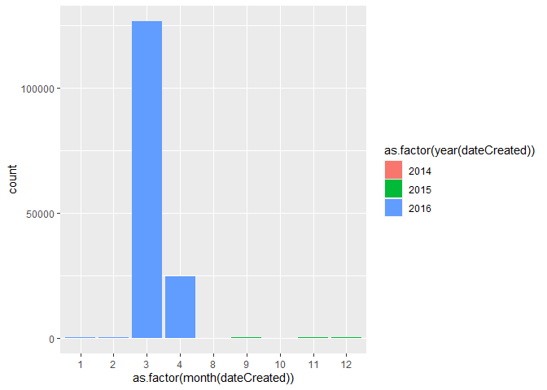
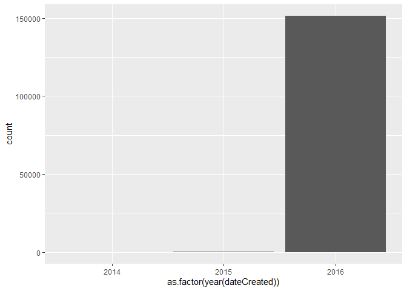
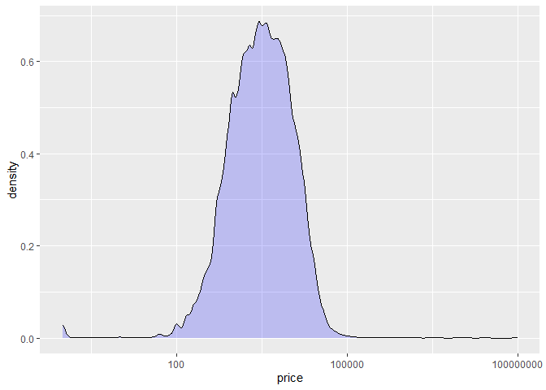
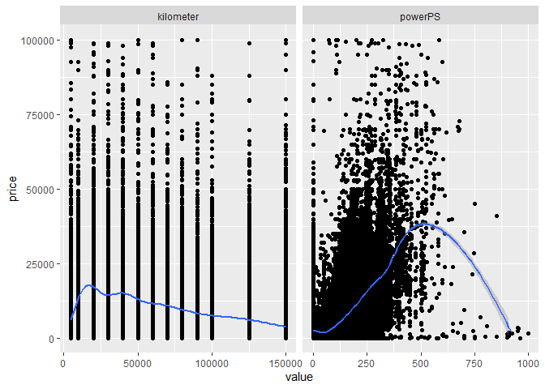
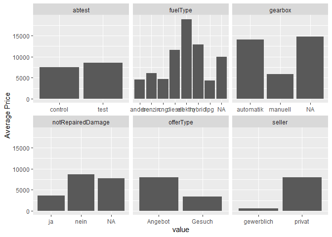
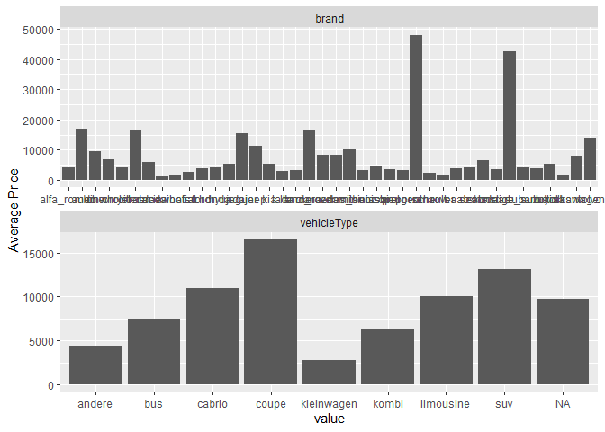
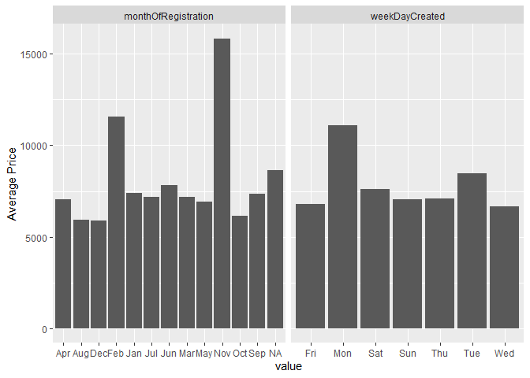

project part 1
================

Problems:

1.  posting dates are not random, data retrieved during a small 1-2
    month window

Solvable Problems:

1.  in German

2.  many NA’s coded as 999… or empty string “”

3.  registration date is separate

4.  postal code is coded as continuous

5.  nrOfPictures is all 0’s

6.  fake values make price drop off at extremes where the price should
    be higher. e.g. powerPS

7.  

``` r
test$train <- FALSE
train$train <- TRUE

autos <- bind_rows(test, train) %>%
  filter(
    yearOfRegistration < 2022,
    yearOfRegistration > 1900,
    powerPS < 1000
    ) %>% 
  mutate(
    nrOfPictures = NULL,
    name = NULL,
    price = na_if(price, 99999999),
    dateCreated = ymd_hms(dateCreated),
    lastSeen = ymd_hms(lastSeen),
    registered = make_date(yearOfRegistration, monthOfRegistration),
    postalCode = as.character(postalCode),
    weekDayCreated = as.character(wday(dateCreated, label = TRUE)),
    monthOfRegistration = as.character(month(registered, label = TRUE))
    ) %>% 
  mutate_if(is.character, na_if, "")

test.clean <- filter(autos, train == FALSE)
train.clean <- filter(autos, train == TRUE)
save(test.clean, train.clean, file = "autos_clean.Rdata")
```

``` r
cor(select_if(autos, is.numeric), use = "complete.obs")
```

    ##                           price yearOfRegistration     powerPS   kilometer
    ## price               1.000000000        0.005989554  0.02164977 -0.01520107
    ## yearOfRegistration  0.005989554        1.000000000  0.15426583 -0.21414937
    ## powerPS             0.021649774        0.154265833  1.00000000 -0.02169679
    ## kilometer          -0.015201068       -0.214149369 -0.02169679  1.00000000

``` r
options(scipen = 999)
train.clean %>% ggplot() +
  geom_bar(aes(as.factor(month(dateCreated)), fill = as.factor(year(dateCreated))))
```

<!-- -->

``` r
train.clean %>% ggplot() +
  geom_bar(aes(as.factor(year(dateCreated))))
```

<!-- -->

``` r
train.clean %>%  ggplot() +
  geom_density(aes(price), fill = "blue", alpha = 0.2) +
    scale_x_log10()
```

<!-- -->

``` r
train.clean %>% 
  pivot_longer(c(kilometer, powerPS), names_to = "variable", values_to = "value") %>% 
  ggplot(aes(value, price)) +
    geom_point() +
    geom_smooth() +
    facet_wrap(vars(variable), scales = "free_x", ncol = 2) +
    ylim(c(0, 100000))
```

<!-- -->

``` r
train.clean %>% 
  pivot_longer(c(seller, offerType, abtest, gearbox, fuelType, notRepairedDamage), names_to = "variable", values_to = "value") %>% 
  ggplot(aes(value, price)) +
    geom_bar(stat = "summary", fun.y = "mean") +
    facet_wrap(vars(variable), scales = "free_x", ncol = 3) +
    ylab("Average Price")
```

<!-- -->

``` r
train.clean %>% 
  pivot_longer(c(vehicleType, brand), names_to = "variable", values_to = "value") %>% 
  ggplot(aes(value, price)) +
    geom_bar(stat = "summary", fun.y = "mean") +
    facet_wrap(vars(variable), scales = "free", ncol = 1) +
    ylab("Average Price")
```

<!-- -->

``` r
train.clean %>%
  pivot_longer(c(monthOfRegistration, weekDayCreated), names_to = "variable", values_to = "value") %>%
  ggplot(aes(value, price)) +
    geom_bar(stat = "summary", fun.y = "mean") +
    facet_wrap(vars(variable), scales = "free_x", ncol = 2) +
    ylab("Average Price")
```

<!-- -->
